# Housing Price Prediction for Greater Kuala Lumpur

Predicting residential property prices in the Greater Kuala Lumpur (GKL) region using gradient-boosted tree models trained on scraped 2019 listing data. The pipeline covers everything from raw CSV to SHAP-based interpretation, with geospatial feature engineering built on pre-collected OpenStreetMap coordinates.

This project began as a group assignment for BAA5073 Data Mining (MsBA, Sunway University) and was later refactored from scratch for portfolio use -- better methodology, faster training, cleaner code.

---

## Results at a Glance

| Model | R-squared | MAE | RMSE | Tuning |
|-------|-----------|-----|------|--------|
| Ridge | 0.7945 | 0.2990 | 0.3788 | Fixed alpha |
| **LightGBM** | **0.9493** | **0.1284** | **0.1881** | Optuna, 50 trials |
| XGBoost | 0.9477 | 0.1295 | 0.1910 | Optuna, 50 trials |
| CatBoost | 0.9477 | 0.1304 | 0.1911 | Optuna, 50 trials |

> All metrics are computed on log-transformed prices (via `np.log1p`). Full results with best hyperparameters are in `data/processed/model_results.json`.

---

## Dataset

**Source:** [Property Listings in Kuala Lumpur](https://www.kaggle.com/datasets/dragonduck/property-listings-in-kuala-lumpur) (Kaggle)

The raw CSV contains 53,883 scraped property listings from 2019. After cleaning -- removing land-only listings, parsing mixed-format size strings, treating outliers with domain-informed thresholds, and dropping rows without geocodable addresses -- 45,911 rows remain across 9 simplified property types.

### Feature Engineering Highlights

- **Log-transformed target:** `np.log1p(Price)` reduces right skew from 3.08 to 0.53, bringing the target much closer to normal.
- **Geospatial distances:** Haversine distance from each property to KLCC and to the nearest point of interest in seven categories (malls, hospitals, schools, colleges, universities, bus stations, rail stations). Computed with vectorised NumPy broadcasting -- what would take minutes with per-row iteration runs in under a second.
- **Property type simplification:** 20+ raw categories mapped to 9 meaningful groups (Condominium, Apartment, Terrace/Link House, etc.).
- **One-hot encoding** of property type and furnishing status for tree-based models.

---

## Project Structure

```
.
├── data/
│   ├── raw/                     # Original Kaggle CSV (gitignored)
│   └── processed/               # Cleaned CSVs + model results JSON (gitignored)
├── notebooks/
│   ├── 01_data_preparation.ipynb
│   ├── 02_eda_distributions.ipynb
│   ├── 03_eda_relationships.ipynb
│   ├── 04_modelling.ipynb
│   └── 05_evaluation.ipynb
├── outputs/
│   └── figures/                 # All generated PNG figures
├── src/
│   ├── config.py                # Paths, constants, colour palettes
│   ├── data_preparation.py      # Full cleaning + feature engineering pipeline
│   ├── eda.py                   # EDA visualisation functions
│   └── modelling.py             # Training, tuning, evaluation, SHAP
├── requirements.txt
└── README.md
```

The `src/` scripts contain all reusable logic. The notebooks call into them and add narrative commentary -- run the notebooks in order from 01 to 05, or run the scripts directly:

```bash
python -m src.data_preparation   # Clean data, save to data/processed/
python -m src.eda                # Generate EDA figures
python -m src.modelling          # Train all models, generate evaluation figures
```

---

## Setup

```bash
git clone https://github.com/<your-username>/housing-price-prediction-gkl.git
cd housing-price-prediction-gkl

python -m venv .venv
source .venv/bin/activate        # Windows: .venv\Scripts\activate

pip install -r requirements.txt
```

Place the raw Kaggle CSV at `data/raw/property_listings_kl.csv`. The pipeline also expects geocoded coordinates and POI data in `_archive/` (not tracked in git) -- these were pre-collected via OpenStreetMap Nominatim and Overpass APIs and cannot be reproduced without external API calls.

---

## Methodology

### Data Preparation

1. Remove land-only listings (residential land, agricultural land, etc.)
2. Drop exact duplicates
3. Parse price strings (`"RM 450,000"` to float), size strings (mixed `Built-up: X sq. ft. / Land area: Y sq. ft.` formats), and room counts (`"3+1"` to 4, `"Studio"` to 1)
4. Simplify 20+ property types into 9 groups; clean furnishing labels into 4 categories
5. Impute missing values with median-by-property-type, then global median as fallback
6. Treat outliers: RM 42,000 floor (aligned with Malaysian low-cost housing threshold), 99.5th percentile ceiling, minimum 250 sq ft built-up area, structural feature caps at 10
7. Add log-transformed price, price per square foot, and geospatial distance features
8. One-hot encode categorical variables

### Modelling

All models predict `Price_Log = log(1 + Price)`. The dataset is split 80/20 with a fixed random seed.

- **Ridge Regression** -- linear baseline with fixed regularisation (alpha = 1.0), trained on standardised features.
- **LightGBM, XGBoost, CatBoost** -- gradient-boosted trees, each tuned with Optuna's TPE sampler over 50 trials and 5-fold cross-validation. Search spaces cover tree depth, learning rate, regularisation strength, subsampling ratios, and leaf parameters.

The original assignment used 10-fold CV with RandomizedSearchCV and took roughly an hour to train. This version finishes in minutes.

### Evaluation

- Bar chart comparison of R-squared, MAE, and RMSE across all models
- Actual vs predicted scatter plots (log scale)
- Residual plots to check for systematic bias
- Error stratification by price decile -- confirms the expected U-shaped pattern (higher error at both extremes, since tree models cannot extrapolate beyond training bounds)
- Split-based feature importance (top 15 features per model)
- SHAP beeswarm summary for the best-performing model

---

## Figures

### Target Distribution

Raw prices are heavily right-skewed. The log transform brings the distribution close to normal.

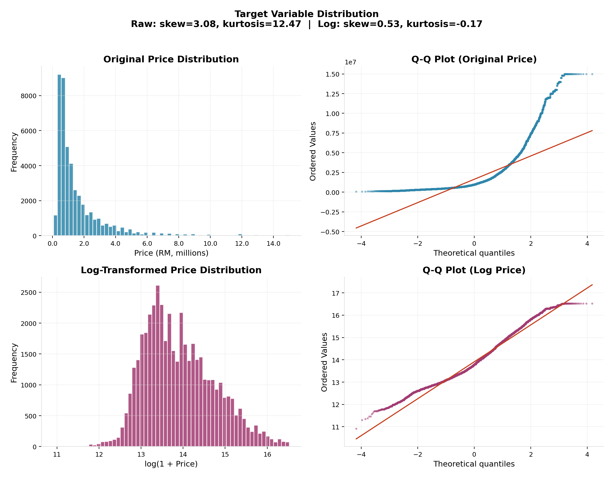

### Structural Feature Distributions

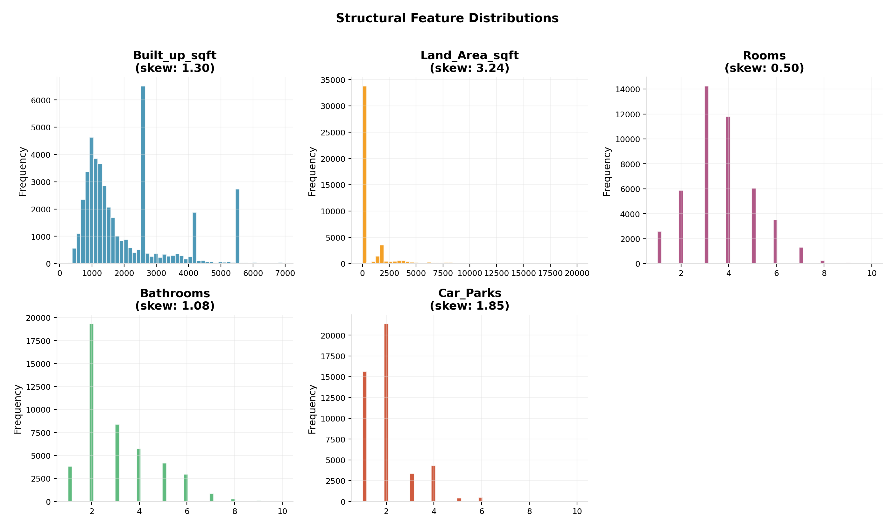

### Distance Feature Distributions

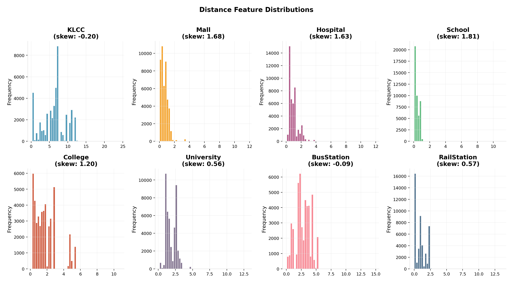

### Categorical Distributions

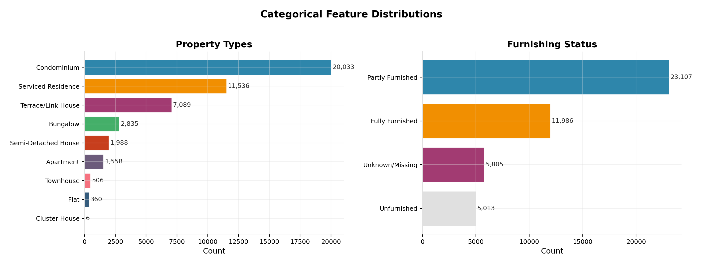

### Bivariate Analysis

Built-up area shows the strongest positive relationship with price. Distance to KLCC shows a clear negative gradient -- properties closer to the city centre command higher prices.

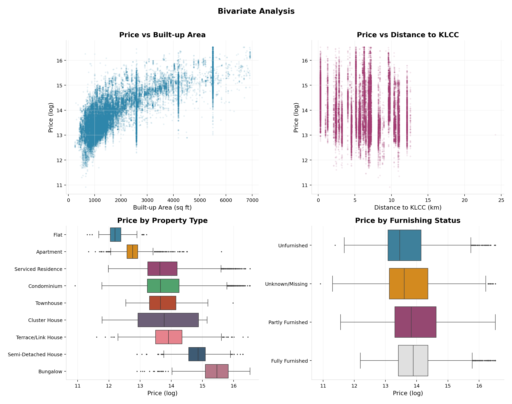

### Correlation Matrix

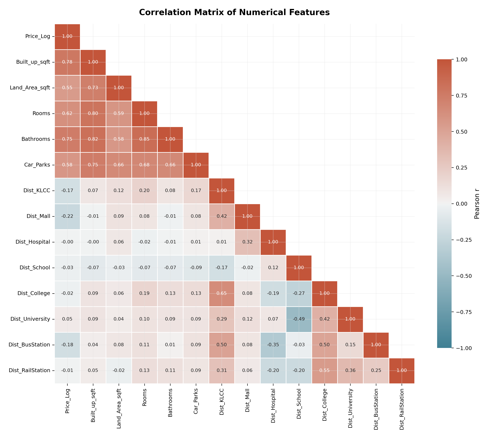

### Geospatial Map

Property locations across GKL, aggregated by area. Dot size reflects listing count; colour reflects median log price. The KLCC marker sits at the centre of the highest-price cluster.

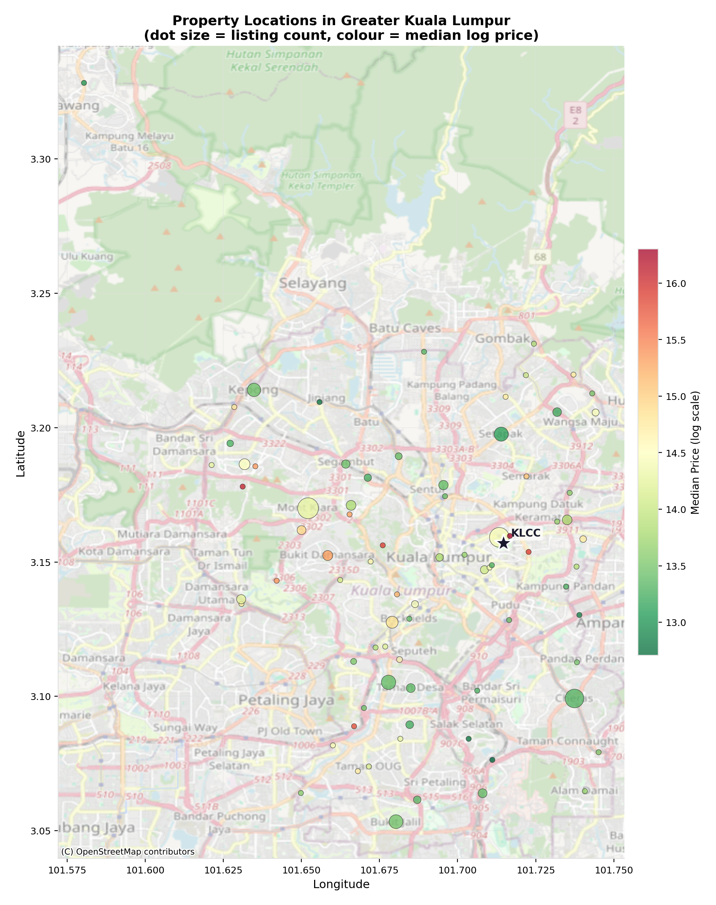

### Model Comparison

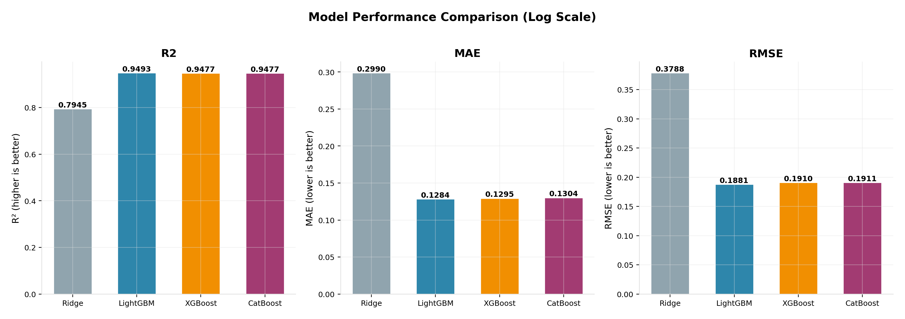

### Actual vs Predicted

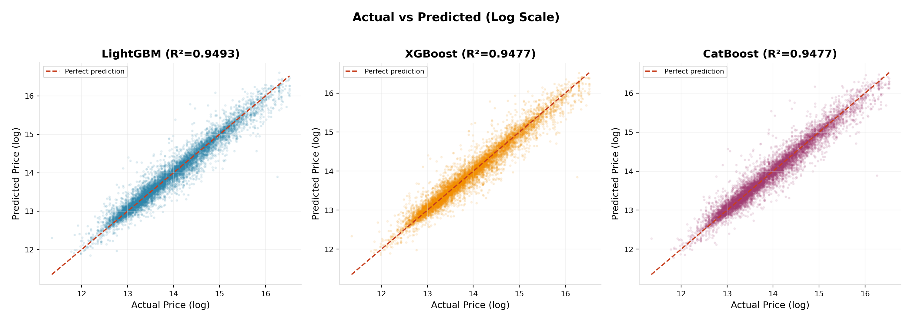

### Residual Plots

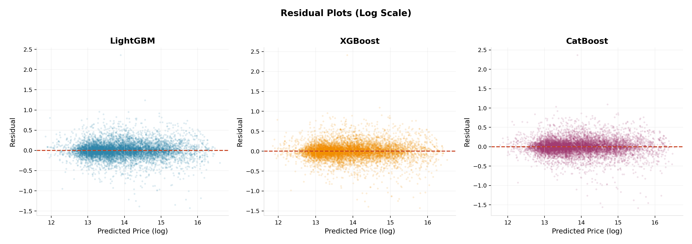

### Error Stratification

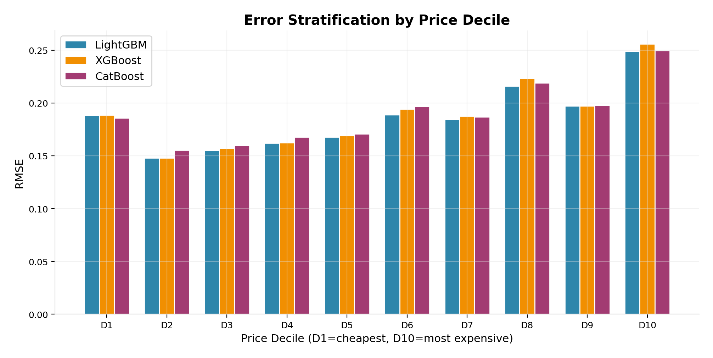

### Feature Importance

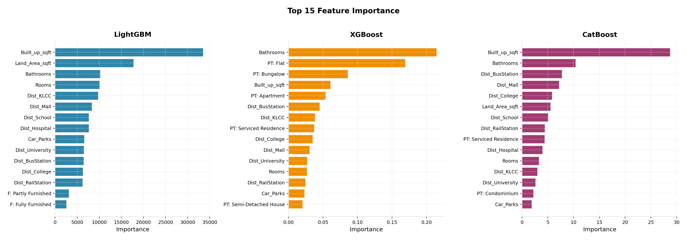

### SHAP Summary

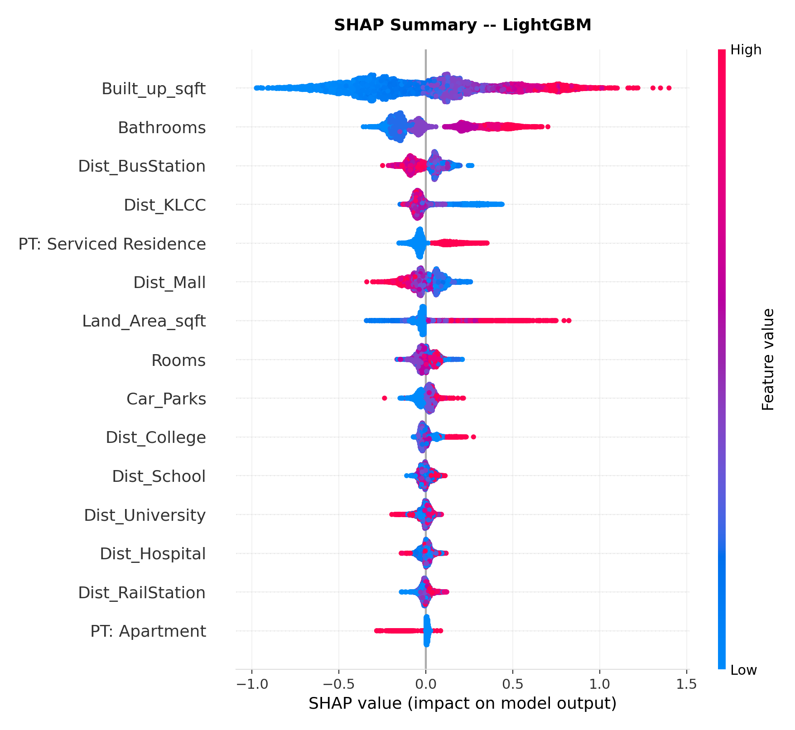

---

## Key Findings

- **Built-up area** is the single strongest predictor of price across all models and interpretability methods.
- **Structural features** (bathrooms, rooms, car parks) rank consistently in the top tier, above most distance features.
- **Distance to the nearest bus station** and **distance to KLCC** are the most informative geospatial features, according to SHAP values. Proximity to public transport and commercial centres matters more than proximity to schools or hospitals.
- Tree-based models produce a characteristic U-shaped error curve by price decile: they struggle at both extremes because they cannot predict values outside their training range.
- The log transform is critical. Without it, models chase the right tail of the price distribution and perform poorly on the majority of listings.

---

## Acknowledgements

**Original group members:**
- Wai Yan Moe
- Ameiyrul Hassan bin Ashruff Hassan
- Tengku Maimunah binti Tengku Iskandar
- Yew Yen Bin

**Data source:** [dragonduck/property-listings-in-kuala-lumpur](https://www.kaggle.com/datasets/dragonduck/property-listings-in-kuala-lumpur) on Kaggle

Geocoding coordinates were collected from OpenStreetMap via the Nominatim and Overpass APIs. Point-of-interest data covers seven categories across the GKL bounding box (lat 2.987--3.275, lon 101.575--101.816).

---

## Licence

MIT
